# RUMIÑAHUI — M3.5 "What Held the Line": Level-Flow Diagram
### Companion document to the Combat Design Doc — the mission's structural blueprint

M3.5 is the game's most mechanically unusual mission: a single unbroken sequence where control passes between Rumiñahui, Chaska, and Atoc as the battle at the huaca collapses. This document lays out that flow so it can be built as one continuous level rather than three separate ones stitched together.

---

## 1. FLOW DIAGRAM

```mermaid
flowchart TD
    A[MISSION START<br/>Plays as Rumiñahui<br/>Holding the breach alone] --> B{Line begins to fail}
    B --> C[Scripted moment:<br/>Rumiñahui staggers, drops to one knee<br/>Vision flash — Willka's fireside voice, audio only]
    C --> D[CONTROL SHIFT 1<br/>Plays as Chaska<br/>She was pinned at the flank — now free]
    D --> E[Chaska fights across the flank toward Rumiñahui's position<br/>Kuntur kit fully active: marks, aerial finishers]
    E --> F{Chaska reaches the breach}
    F --> G[Scripted moment:<br/>She reaches him, but a second collapse opens<br/>behind them — Atoc's cage/holding point is exposed]
    G --> H[CONTROL SHIFT 2<br/>Plays as Atoc, still nominally a prisoner<br/>Chained hands break free in the chaos]
    H --> I[Atoc fights through the exposed rear line<br/>Amaru kit fully active: traps, Venom Riposte, decoys]
    I --> J{All three converge at the huaca}
    J --> K[CONVERGENCE POINT<br/>All three on-screen together for the first time<br/>Brief 3-way dialogue beat, no combat]
    K --> L[FINAL WAVE<br/>Player controls Rumiñahui again<br/>Chaska and Atoc now fight as full AI allies,<br/>each using their own kit at full strength]
    L --> M{Final wave cleared}
    M --> N[ULTIMATE SEQUENCE<br/>Shared vision — all three see the Puma/Condor/Amaru<br/>imagery simultaneously — 'What Held the Line' triggers]
    N --> O[Scripted victory beat:<br/>The position holds. Silence. Exhaustion.]
    O --> P[MISSION END<br/>Transitions directly into M3.6 'After the Fire']
```

---

## 2. DESIGN INTENT PER STAGE

| Stage | Who plays | Purpose |
|---|---|---|
| A–C | Rumiñahui | Re-establish stakes and his Puma kit at full intensity before taking control away — the loss of control has to be felt, not just noticed |
| D–F | Chaska | First solo combat proof of her Kuntur kit outside M3.2; reinforces her "reckless speed" era right before Act III's cost lands on her |
| G–I | Atoc | The moment his loyalty stops being a question the story asks and starts being a question the *player* answers through play — he could theoretically disengage here and doesn't |
| J–K | All three | The only non-combat beat in the mission — deliberately placed as a breath before the hardest wave, not after it |
| L | Rumiñahui (as lead) | Demonstrates all three kits functioning together as a system, not just sequentially — this is the actual mechanical proof of "power sharing" |
| N | All three | The vision/ultimate sequence — kept ambiguous per the story's "legend, not literal magic" rule; visually striking, narratively unconfirmed |

---

## 3. TECHNICAL / IMPLEMENTATION NOTES

- **No loading screens between control shifts.** The stagger/vision-flash beats (C, G) exist specifically to mask a camera cut that can hide a character-controller swap without a hard load — this should be treated as a hard engineering requirement, not just a nice-to-have, since a visible load here would break the "unbroken sequence" premise the whole mission is built on.
- **Difficulty curve:** each control-shift section (D–F, G–I) should be tuned *slightly* easier than a standalone mission using that kit would be — the player is meant to feel capable stepping into an unfamiliar kit mid-crisis, not punished for it. Save the mission's real difficulty spike for stage L, once the player is back in the kit they've spent the whole game mastering.
- **Camera:** stage K (convergence) is the one moment in the whole game where all three character models share a frame with no combat UI on screen — worth a dedicated cinematic camera pass rather than reusing in-combat camera logic.
- **Audio:** Willka's voice at stage C should reuse his exact fireside VO lines from M1.2 rather than new recorded lines — the repetition is the point.
- **Fail-state handling:** if the player dies during D–F or G–I, respawn should return them to the start of that character's section only (not all the way back to stage A) — this mission is long enough that a full restart on failure would undercut its pacing.

---

## NEXT STEPS
With the story bible, mission list, combat design doc, dialogue script, and this flow diagram in hand, the remaining natural documents (whenever useful) would be:
1. A similar flow diagram for M5.3 ("Into the Llanganates"), the other structurally unusual mission (free character-switching traversal puzzle)
2. A short "world bible" covering visual/art direction references (Píllaro, Quito pre- and post-fire, the Llanganates) for whoever builds environments in Claude Code
3. An enemy roster spec sheet (stats, tells, and which kit counters which enemy type) to pair with Section 5 of the Combat Design Doc
