# RUMIÑAHUI — M5.3 "Into the Llanganates": Level-Flow Diagram
### Companion document to the Combat Design Doc and the M3.5 Flow Diagram

Unlike M3.5 (forced sequential control shifts under combat pressure), M5.3 is a **free-switching cooperative traversal puzzle** with no combat at all — the tonal opposite of M5.2's city-scale destruction, staged immediately after it. The player can swap between Rumiñahui, Chaska, and Atoc at will (subject to a few gated moments below) to solve terrain the other two can't cross alone.

---

## 1. FLOW DIAGRAM

```mermaid
flowchart TD
    A[MISSION START<br/>All three enter the Llanganates foothills together<br/>Free character-switch enabled] --> B[OBSTACLE 1: The Fallen Gate<br/>A collapsed stone door blocks the only path]
    B --> B1[Requires Rumiñahui — Puma strength check<br/>heaves the stone aside]
    B1 --> C[OBSTACLE 2: The Wide Break<br/>A ravine too wide to climb, too deep to fall into safely]
    C --> C1[Requires Chaska — Kuntur glide/Vantage Leap<br/>crosses first, then drops a line for the others]
    C1 --> D[OBSTACLE 3: The Narrow Dark<br/>A crevice passage riddled with old rigged deadfalls<br/>— defensive traps left by earlier travelers, not enemies]
    D --> D1[Requires Atoc — Amaru trap-sense<br/>disarms/reads the deadfalls, guides the others through]
    D1 --> E{All three regroup at the inner approach}
    E --> F[OBSTACLE 4: The Joint Lift<br/>The treasure itself — too heavy and awkward<br/>for one person to move alone]
    F --> F1[COOPERATIVE PUZZLE — all three required simultaneously:<br/>Rumiñahui braces/lifts, Chaska spots the safe path from height,<br/>Atoc clears the final approach of old traps]
    F1 --> G[THE HIDING CHAMBER<br/>Quiet, non-interactive placement of the treasure<br/>No loot, no reward pickup — deliberately anti-climactic]
    G --> H[DIALOGUE BEAT<br/>The three of them, alone, agreeing never to speak of the location again]
    H --> I[MISSION END<br/>Transitions into M5.4 'The Long Retreat']
```

---

## 2. DESIGN INTENT PER STAGE

| Stage | Kit required | Purpose |
|---|---|---|
| B (Fallen Gate) | Puma | Reintroduces Rumiñahui's strength-check traversal role after an act of destruction — grounding him back in something constructive |
| C (Wide Break) | Kuntur | Chaska's moment to lead — she crosses first and enables the others, mechanically reinforcing her role as the one who "sees the gap" |
| D (Narrow Dark) | Amaru | Atoc's moment to lead — trap-sense here is framed as protective rather than offensive, a deliberate softening of his kit's usual combat identity |
| F (Joint Lift) | All three simultaneously | The mission's actual thesis: the treasure cannot be hidden by any one of them alone — mechanically dramatizes their interdependence right before Act V splits them up for the guerrilla campaign |
| G (Hiding Chamber) | — | No gameplay reward on purpose. Cutting the expected "loot moment" is intentional: this treasure is not for the player, it's the one thing in the story nobody gets to have |

---

## 3. TECHNICAL / IMPLEMENTATION NOTES

- **Character-switch UI:** a simple radial or shoulder-button cycle available at all times except during stage F, where the game should auto-lock the player to whichever character is mid-action to avoid a switch interrupting a synchronized animation.
- **Non-required characters:** while one character solves an obstacle, the other two should be positioned as idle/actively-animated AI (resting, keeping watch, commenting occasionally) rather than simply vanishing — reinforces that this is a shared journey, not a relay race.
- **No fail state on any obstacle.** This mission should not be able to be lost — no combat, no timers, no health loss. If a player fails an input (e.g., a timed glide in stage C), the correct response is a recoverable stumble/retry, never a checkpoint reload. This is the game's one deliberately low-stress mission, by design, right before the guerrilla campaign ramps difficulty back up.
- **Optional collectibles:** this is a strong place for 2–3 optional lore/collectible items (old Willka-era relics, or in-world objects referencing the Three Worlds story) — low-stakes exploration fits the mission's tone better than combat side-content would.
- **Audio direction:** should be the quietest mission in the game — minimal score, mostly ambient (wind, water, footsteps) — a deliberate contrast to M5.2 immediately before it.

---

# RUMIÑAHUI — Enemy Roster Spec Sheet
### Companion document to the Combat Design Doc, Section 5

Covers every enemy archetype across the campaign, organized by era, with stats framed relatively (Low/Med/High/Very High) rather than hard numbers so this scales to whatever engine/balancing pass Claude Code ends up doing. Each entry lists its tell (the visual cue that signals its attack) and which kit counters it most cleanly — useful both for encounter design and for tuning which missions should feature which enemies.

---

## 1. ANDEAN-ERA ENEMIES (Prologue–Act IV)

### Skirmisher
- **First appearance:** M1.3
- **HP:** Low · **Damage:** Low · **Speed:** High
- **Behavior:** Fast, harasses from range with slings, retreats when approached
- **Tell:** Winds up visibly before a sling throw
- **Countered by:** Kuntur (Condor's Eye mark + aerial closing distance) or Puma's Root-Step to close ground fast
- **Design role:** teaches players to prioritize targets, not just fight whoever's closest

### Shield-Bearer
- **First appearance:** M1.3 (basic), M2.1 (armored variant)
- **HP:** Med · **Damage:** Med · **Speed:** Low
- **Behavior:** Advances slowly behind a full shield, only exposed after a guard-break
- **Tell:** Shield lowers briefly after 2–3 blocked hits
- **Countered by:** Puma (Warclub Crush / Earthbreaker guard-break)
- **Design role:** core Puma-kit teaching enemy — this is the "textbook" use case for the heavy-attack loop

### Ambush-Type (Highland Scout)
- **First appearance:** M2.3 (the ambush that kills Willka)
- **HP:** Low · **Damage:** High (burst) · **Speed:** Med
- **Behavior:** Hides until triggered, opens with a high-damage sneak attack, then fights normally
- **Tell:** A very brief pre-ambush audio cue (a snapped branch/bird startle) — rewards players who are listening, not just watching
- **Countered by:** Amaru (Snare traps neutralize their ambush advantage preemptively) — deliberately not available to the player until later, meaning the Willka ambush in M2.3 is unwinnable "cleanly" the first time, which is the point
- **Design role:** the enemy type most directly tied to the story's thesis about vigilance

### Atoc's Lieutenant (mini-boss)
- **First appearance:** M3.3
- **HP:** High · **Damage:** Med-High · **Speed:** Med
- **Behavior:** A tougher, named mix of Shield-Bearer defense and Skirmisher ranged pressure — a "final exam" enemy for everything learned so far
- **Tell:** Combo-specific — telegraphs a 3-hit unblockable string with a distinct wind-up roar
- **Countered by:** any kit with correct timing; deliberately kit-agnostic as a difficulty gate rather than a puzzle
- **Design role:** mini-boss tier, gatekeeping the M3.4 duel with Atoc himself

### Atoc (story boss, M3.4 only)
- **HP:** Very High · **Damage:** High · **Speed:** High
- **Behavior:** Full Amaru-style kit — traps, counters, decoys — used against the player for the only time in the game before Atoc becomes an ally
- **Tell:** Multiple, deliberately varied — this fight is designed to teach the player to read Amaru-style tells generally, since they'll be relying on an ally using the same kit from M3.6 onward
- **Countered by:** patience — Puma's Stone Parry punishes his counter-heavy style particularly well
- **Design role:** the game's first true boss; ends in the mandatory "spare" prompt (see Mission List, M3.4)

---

## 2. SPANISH-ERA ENEMIES (Act V)

Deliberately different guard-break thresholds, different tells, and a new verticality/ranged threat (cavalry, firearms) than anything in Acts I–IV — mechanically signals that Act V's stakes have changed, independent of the story doing the same thing narratively.

### Spanish Infantry
- **First appearance:** M5.1
- **HP:** Med · **Damage:** Med · **Speed:** Low-Med
- **Behavior:** Tighter formation fighting than Andean Shield-Bearers; steel armor gives a higher guard-break threshold
- **Tell:** Shorter, sharper wind-ups than Andean enemies — rewards faster reaction time, a deliberate difficulty increase
- **Countered by:** Puma, but requires more hits to break guard than the Act I–III equivalent — no kit trivializes Act V the way Puma trivialized early Shield-Bearers
- **Design role:** re-teaches the guard-break loop at a harder tier

### Spanish Cavalry
- **First appearance:** M5.1
- **HP:** Med · **Damage:** High (charge) · **Speed:** Very High
- **Behavior:** Charges in straight lines, vulnerable during the recovery after a missed charge
- **Tell:** Long, telegraphed charge wind-up, but punishing if not dodged correctly
- **Countered by:** Kuntur (Skywalk dash timing) or environmental use (narrow terrain removes their charge lanes entirely)
- **Design role:** first enemy type that actively punishes players who default to blocking (Puma's usual safe option) rather than dodging

### Firearm-User (Arquebusier)
- **First appearance:** M5.2
- **HP:** Low · **Damage:** Very High (single hit) · **Speed:** Low
- **Behavior:** Stationary or slow-moving, long reload between shots, devastating if allowed to fire freely
- **Tell:** Visible match-lock smoke/flare a beat before firing — a hard telegraph, but punishing if ignored
- **Countered by:** Amaru (decoys bait a shot during reload downtime) or aggressive Kuntur closing-speed to shut them down before they can fire twice
- **Design role:** the mission-list's flagged "rug-pull on the patient Puma player" — standing still or holding a block is actively wrong against this enemy, forcing a playstyle adjustment right when the player might feel over-comfortable

### Spanish Officer (mini-boss)
- **First appearance:** M5.4
- **HP:** High · **Damage:** High · **Speed:** Med
- **Behavior:** Commands nearby infantry buffs while alive; fight is as much about disrupting the buff as damaging the officer directly
- **Tell:** A raised-sword "rally" animation before buffing nearby troops — interruptible if punished quickly
- **Countered by:** any kit, but rewards target-prioritization thinking (kill/disrupt the officer first) over raw damage race
- **Design role:** guerrilla-campaign mini-boss, reinforces Act V's attrition theme — these fights should feel costly even when won

---

## 3. QUICK-REFERENCE COUNTER TABLE

| Enemy | Best counter kit | Why |
|---|---|---|
| Skirmisher | Kuntur | Ranged pressure needs ranged/aerial answers |
| Shield-Bearer | Puma | Textbook guard-break matchup |
| Ambush-Type | Amaru | Traps neutralize the ambush advantage |
| Atoc's Lieutenant | Any (skill-gated) | Deliberate kit-agnostic difficulty check |
| Atoc (boss) | Puma (Stone Parry) | Punishes his counter-heavy style |
| Spanish Infantry | Puma (harder variant) | Same loop, raised difficulty |
| Spanish Cavalry | Kuntur | Dodge timing beats blocking |
| Arquebusier | Amaru or Kuntur | Bait-and-punish or close distance fast |
| Spanish Officer | Any | Prioritization test, not a kit puzzle |

---

## NEXT STEPS
With these two documents added, the design-side documentation set is close to complete. Remaining candidates, whenever useful:
1. A short visual/art-direction world bible (Píllaro, Quito pre/post-fire, the Llanganates)
2. A boss-fight-specific deep dive on the Atoc duel (M3.4), since it's the game's first true boss and sets the pattern for later ones
3. A short "how the myth ambiguity is signaled to the player" doc — practical direction (camera, sound, color) for keeping every vision sequence deliberately unconfirmed as real or not
